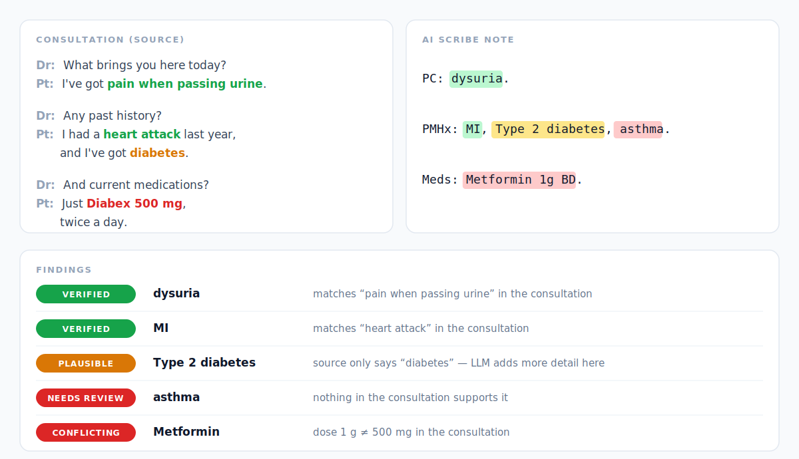
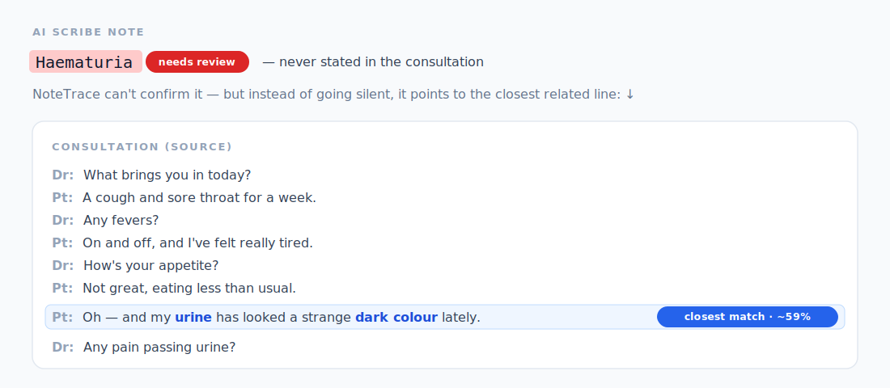

# NoteTrace

A safety net for AI scribe notes. It helps catch hallucinations and errors before they reach the patient record.

AI scribes save time, but they can invent a diagnosis, miswrite a dose, or put a procedure on the wrong side. NoteTrace compares the AI-written note against the actual consultation (the transcript, or any source you trust) and flags clinical details:

🟢 **verified** · 🟡 **plausible** · 🔴 **conflicting** · 🔴 **needs review**

It understands clinical language, not just words — it knows "panadol" is paracetamol and "MI" is a heart attack — and it checks medication doses and procedure left/right, catching slips a simple text search would miss. When it can't confirm a finding, it points to the closest matching part of the source — so you know where to look, not just that something's missing. See **[worked examples](docs/examples.md)** of each.

<p align="center"></p>

**And when a finding isn't supported, it points to the closest related line — not a silent miss:**

<p align="center"></p>

## Beyond AI scribes

NoteTrace checks any LLM-generated clinical text against its source:

- **Ambient / AI scribe notes** — consultation transcript → note
- **Discharge & referral letters** — chart → generated letter
- **Note summarisation & handover** — long notes → short summary
- **Any clinical LLM output** you can pair with a source document

## Download

Latest builds for Linux and Windows (x86_64):

**[github.com/pisong314/notetrace/releases/latest](https://github.com/pisong314/notetrace/releases/latest)**

| File | Platform |
|---|---|
| `notetrace-<version>-linux-x86_64.tar.gz` | Linux glibc 2.28+ (RHEL 8 / Ubuntu 20.04+) |
| `notetrace-<version>-windows-x86_64.zip`  | Windows 10/11, Server 2019+ |

## Runs locally

**Standalone** — runs entirely on your own computer. Nothing is sent to the cloud; patient data never leaves your practice.

**Requirements:** x86_64 CPU (no GPU), 256 MB RAM, 350 MB disk. Runs fully offline.

## Quickstart

Unzip what you downloaded, then send a `{summary, source}` pair on stdin:

```bash
echo '{"summary":"pt takes paracetamol 1g QID",
       "source":"patient takes panadol 500 mg four times a day"}' \
  | ./notetrace-json
```

Run from the unzipped dist directory so `./data` is auto-discovered, or point at it explicitly with `export NOTETRACE_DATA_DIR=/path/to/dist/data` (or `--data-dir`).

Output (truncated):

```json
{
  "items": [
    { "entity_text": "paracetamol",
      "provenance": { "level": "conflicting", "match_kind": "exact",
                      "source_text": "panadol", "confidence": 1.0,
                      "checks": [ { "attribute": "dosage", "status": "conflicts",
                                    "summary_value": "1g", "source_value": "500 mg" } ] } }
  ],
  "stats": { "total": 1, "verified": 0, "plausible": 0, "conflicting": 1, "needs_review": 0 }
}
```

For a long-running server, use `notetrace-server` — see [docs/rest.md](docs/rest.md). Full input/output schema is in the bundled `README.txt`.

## More

- **[docs/examples.md](docs/examples.md)** — what NoteTrace catches: faithful summaries, specification hallucinations, unsupported content, dosage mismatches, …
- **[docs/python.md](docs/python.md)** — Python API: load the engine, get a provenance report, inspect each item
- **[docs/rest.md](docs/rest.md)** — REST server and one-shot JSON CLI
- **[docs/config.md](docs/config.md)** — runtime overrides: boilerplate filters, custom synonyms, semantic-type whitelist

## Known Limitations

- **Base vs salt drug names.** "Metformin" and "metformin hydrochloride" are separate concepts, so one may not match the other across note and source. WIP to resolve this.
- **No negation or family-history detection yet.** "No chest pain" or "family history of diabetes" are treated as if the condition is present. Reliable handling needs more compute (GPU); this build is CPU-only.

## Reporting issues or coverage gaps

Bugs and feature requests → **[Issues](https://github.com/pisong314/notetrace/issues)**.

Please include the dist version, your OS, and a minimal repro (de-identified). The issue templates prompt for these.

**Coverage and tuning are ongoing.** If a clinical concept that should clearly be supported is being flagged as unsupported — or a hallucination is being labelled as verified — open an Issue with the input snippet, the expected provenance, and what you got. Your reports help calibrate the engine.

## Disclaimer

NoteTrace is a **review aid, not a medical device**. It flags content for a clinician to check; it does not approve, reject, or correct notes, and it is not a substitute for clinical judgement. A `verified` result means the source supports the statement — not that the statement is clinically correct. Always review the note against the full record before relying on it.

Maintained by [piyawoot.song@gmail.com](mailto:piyawoot.song@gmail.com). Questions and feedback welcome.
