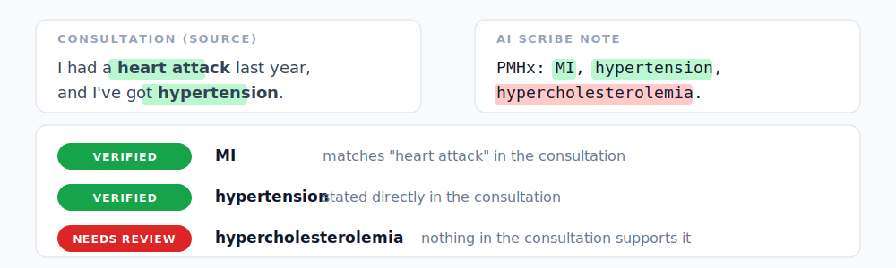
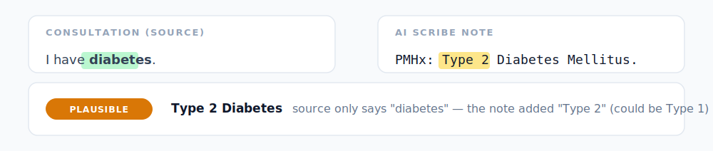
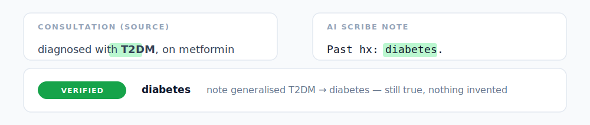
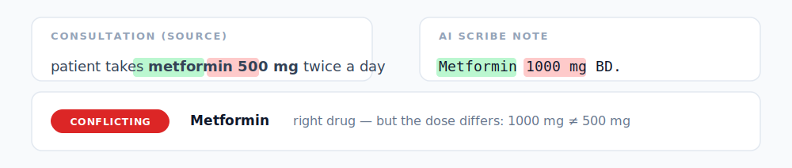
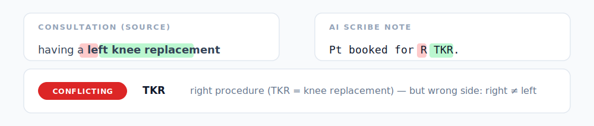
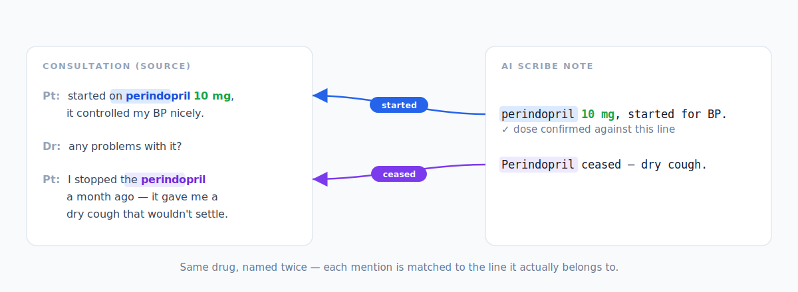

# Examples — what NoteTrace catches

Every entity gets a traffic-light **`level`**:

- 🟢 **`verified`** — the source supports the claim.
- 🟡 **`plausible`** — supported, but broader than the source (the note generalised).
- 🔴 **`conflicting`** / **`needs_review`** — cannot find source or a flat disagreement (wrong medication dose/procedure side). A human must review.

---

## 1. Supported vs unsupported

<p align="center"></p>

**Takeaway**: NoteTrace matches on *meaning*, not form — that's why "MI" finds "heart attack." A claim with nothing behind it in the source is the textbook hallucination it exists to catch.

<details><summary>Raw JSON — input and output</summary>

Input:
```json
{
  "summary": "PMHx: MI, hypertension, hypercholesterolemia.",
  "source": "Doctor: any past medical history? Patient: I had a heart attack last year, and I've got hypertension."
}
```

Output:
```json
{
  "items": [
    { "entity_text": "MI",
      "provenance": { "level": "verified", "match_kind": "exact",
                      "source_text": "heart attack", "confidence": 1.0 } },
    { "entity_text": "hypertension",
      "provenance": { "level": "verified", "match_kind": "exact",
                      "source_text": "hypertension", "confidence": 1.0 } },
    { "entity_text": "hypercholesterolemia",
      "provenance": { "level": "needs_review", "hints": [] } }
  ]
}
```

</details>

---

## 2. Did the note add detail the source didn't?

A note can claim *more* detail than the source supports (risky) or *less* (harmless). NoteTrace tells them apart.

### Risky — note more specific than source

<p align="center"></p>

### Safe — note more general than source

<p align="center"></p>

**Takeaway**: more specific than the record is the dangerous direction (the AI inventing detail); more general is harmless. A keyword search would treat both as the same hit on "diabetes".

<details><summary>Raw JSON — input and output</summary>

Risky — input:
```json
{
  "summary": "PMHx: Type 2 Diabetes Mellitus.",
  "source": "Doctor: Any past medical history? Patient: I have diabetes."
}
```

Risky — output:
```json
{
  "entity_text": "Type 2 Diabetes Mellitus",
  "provenance": { "level": "plausible", "match_kind": "source_broader",
                  "source_text": "diabetes", "confidence": 1.0 }
}
```

Safe — input:
```json
{
  "summary": "Past hx: diabetes.",
  "source": "Patient diagnosed with T2DM, now on metformin."
}
```

Safe — output:
```json
{
  "entity_text": "diabetes",
  "provenance": { "level": "verified", "match_kind": "source_narrower",
                  "source_text": "T2DM", "confidence": 1.0 }
}
```

</details>

---

## 3. No match, but not silent — NoteTrace points to where to look

<p align="center"></p>

**Takeaway**: *haematuria* means blood in the urine, but discolouration has many non-blood causes. NoteTrace doesn't decide whether the note is right — it flags that the source doesn't confirm it, and shows where to look.

<details><summary>Raw JSON — input and output</summary>

Input:
```json
{
  "summary": "Pt reported haematuria.",
  "source": "Doctor: What brings you in today? Patient: I've had a cough and sore throat for about a week. Doctor: Any fevers? Patient: On and off, and I've felt really tired. Doctor: How's your appetite? Patient: Not great, eating less than usual. Doctor: Anything else you've noticed? Patient: Oh — and my urine has looked a strange dark colour lately. Doctor: Any pain passing urine?"
}
```

Output:
```json
{
  "entity_text": "Haematuria",
  "provenance": {
    "level": "needs_review",
    "hints": [
      {
        "source_text": "Doctor: Anything else you've noticed? Patient: Oh — and my urine has looked a strange dark colour lately. Doctor: Any pain passing urine?",
        "source_span": { "start": 246, "end": 384 },
        "similarity": 0.59
      }
    ]
  }
}
```

</details>

---

## 4. Dosage conflict — right drug, wrong dose

<p align="center"></p>

**Takeaway**: a keyword match on "metformin" alone would pass this. NoteTrace checks the dose too, so a doubled dose never shows green.

<details><summary>Raw JSON — input and output</summary>

Input:
```json
{
  "summary": "Metformin 1000 mg BD.",
  "source": "patient takes metformin 500 mg twice a day"
}
```

Output:
```json
{
  "entity_text": "Metformin",
  "provenance": {
    "level": "conflicting", "match_kind": "exact",
    "source_text": "metformin", "confidence": 1.0,
    "checks": [
      { "attribute": "dosage", "status": "conflicts",
        "summary_value": "1000mg", "source_value": "500 mg" }
    ]
  }
}
```

</details>

---

## 5. Laterality conflict — right procedure, wrong side

<p align="center"></p>

**Takeaway**: NoteTrace expands the acronym TKR to "knee replacement" *and* checks the side — catching a left/right flip that's easy to miss on a quick read and dangerous in theatre.

<details><summary>Raw JSON — input and output</summary>

Input:
```json
{
  "summary": "Pt booked for R TKR.",
  "source": "Doctor: You will be having a left knee replacement. Let's book you in."
}
```

Output:
```json
{
  "entity_text": "TKR",
  "provenance": {
    "level": "conflicting", "match_kind": "source_broader",
    "source_text": "knee replacement", "confidence": 1.0,
    "checks": [
      { "attribute": "laterality", "status": "conflicts",
        "summary_value": "right", "source_value": "left" }
    ]
  }
}
```

</details>

---

# Context alignment — which line each mention belongs to

When the same concept appears more than once in the source, NoteTrace matches each note mention to the occurrence whose surrounding text fits — not just the first. That checks every claim against the *right* line and points the clinician straight to it.

<p align="center"></p>

**Source transcript**:
> Patient: I was started on perindopril 10 mg last year and it controlled my blood pressure well.\
> Doctor: Any problems with it?\
> Patient: Yeah, I stopped the perindopril a month ago — it gave me a dry cough that wouldn't settle.

**LLM-generated note**:
> Started on perindopril 10 mg for blood pressure. Perindopril later ceased due to a dry cough.

**Takeaway**: matching to the wrong mention would check the dose or side against the wrong line — a false alarm, or a missed error. Anchoring by context avoids that.

<details><summary>Raw JSON — input and output</summary>

Input:
```json
{
  "summary": "Started on perindopril 10 mg for blood pressure. Perindopril later ceased due to a dry cough.",
  "source": "Patient: I was started on perindopril 10 mg last year and it controlled my blood pressure well. Doctor: Any problems with it? Patient: Yeah, I stopped the perindopril a month ago — it gave me a dry cough that wouldn't settle."
}
```

Output:
```json
{
  "items": [
    { "entity_text": "perindopril",
      "provenance": { "level": "verified", "match_kind": "exact",
                      "source_text": "perindopril",
                      "source_span": { "start": 26, "end": 37 },
                      "context_similarity": 0.53,
                      "checks": [ { "attribute": "dosage", "status": "agrees",
                                    "summary_value": "10mg", "source_value": "10 mg" } ] } },
    { "entity_text": "Perindopril",
      "provenance": { "level": "verified", "match_kind": "exact",
                      "source_text": "perindopril",
                      "source_span": { "start": 155, "end": 166 },
                      "context_similarity": 0.65, "checks": [] } }
  ]
}
```

</details>

---
